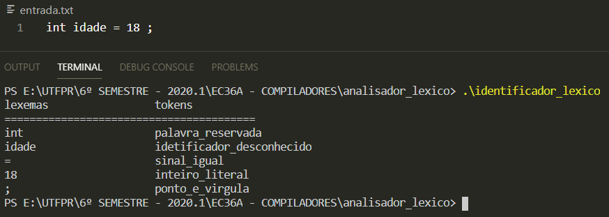

# Analisador Léxico em Linguagem C
Um analisador léxico básico em C para identificar alguns 'lexemas' e exibir seu respectivo 'token'. 
O objetivo da criação do analisador léxico em questão é auxiliar no estudo desse assunto, para a disciplina de Compiladores, a partir da lógica inicial aprendida em sala. Sendo assim, o analisador é apenas para fins de aprendizado e portanto está limitado aos tokens previamente inseridos.

Para testá-lo, basta compilar o arquivo 'identificador_lexico.c', colocar o que for ser analisado dentro do arquivo 'entrada.txt' e executar o programa.

Exemplo de análise lexica realizada nesse analisador:
 

  

